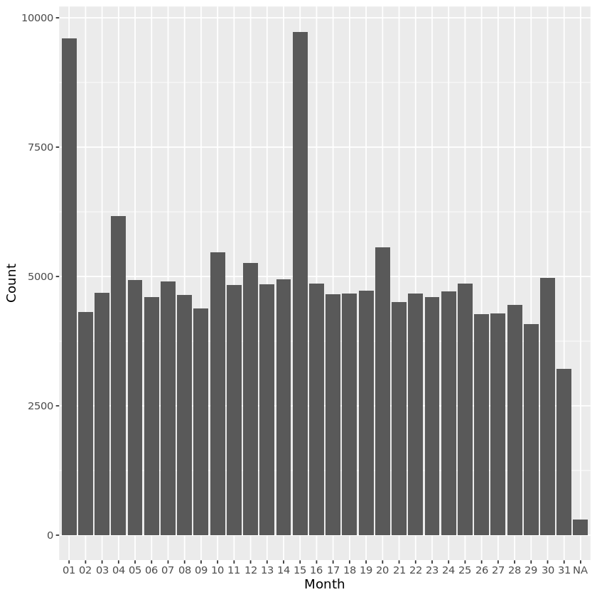
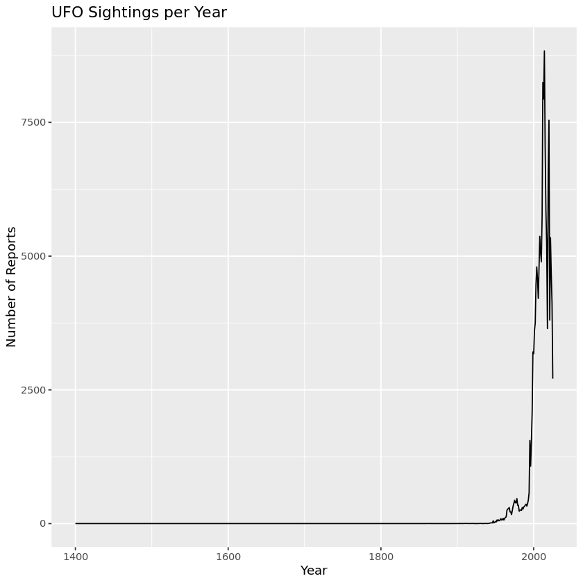

# Homework 04
For questions 2-6, please use hw4.zip, which contains a data base of patient/hopsital data.

## Question 1
*For this question, you can either import these tables into R and do each join, or create the tables we expect to see in a Markdown cell.*   
Please see the tables below.  


```R
library(tidyverse)

table_a <- tibble(
  SKU = c(102345, 104567, 108912, 109876, 112233),
  Fruit = c("Apple", "Orange", "Mango", "Blueberry", "Watermelon"),
  Color = c("Red", "Orange", "Yellow", "Blue", "Green"),
  Price = c(1.20, 1.40, 1.70, 3.50, 4.40),
  In_Stock = c("Yes", "Yes", "No", "Yes", "No")
)

table_b <- tibble(
  SKU = c(102345, 105432, 106789, 104567, 107654),
  Fruit = c("Apple", "Banana", "Grape", "Orange", "Pear"),
  Color = c("Red", "Yellow", "Purple", "Orange", "Green"),
  Sale_Price = c(1.00, 0.50, 2.00, 1.20, 1.10),
  Number_in_Stock = c(50, 120, 0, 75, 0)
)
```

    ── Attaching core tidyverse packages ──────────────────────── tidyverse 2.0.0 ──
    ✔ dplyr     1.1.4     ✔ readr     2.1.5
    ✔ forcats   1.0.0     ✔ stringr   1.5.1
    ✔ ggplot2   3.5.1     ✔ tibble    3.2.1
    ✔ lubridate 1.9.3     ✔ tidyr     1.3.1
    ✔ purrr     1.0.2     
    ── Conflicts ────────────────────────────────────────── tidyverse_conflicts() ──
    ✖ dplyr::filter() masks stats::filter()
    ✖ dplyr::lag()    masks stats::lag()
    ℹ Use the conflicted package (<http://conflicted.r-lib.org/>) to force all conflicts to become errors


What would the result be if you did...  
a) Left join  
b) Right join  
c) Inner join  
d) Full join  
e) Semi join  
f) Anti join  

## Question 2
Inspect the data sets in our database!  
a) Import them.  
b) Check out the columns and their variable types using one of R's tibble summary functions.

## Question 3
Using the `full.csv` data set from our database, **pivot longer** by making all of the variables the same type. Use both `patient_ID` and `name` as ID variables. After pivoting, get a `tally` for number of observations per `patient ID`/`name`. (*Hint: We did this in lecture 5!*)  

## Question 4
Pivot longer by making one column per data type. Use both `patient_ID` and `name` as ID variables. After pivoting, get a `tally` for number of each type of observation per `patient ID`/`name`.  

**Helpful Hints:**  
1. You're performing 3 seperate pivots with careful column selection then joining them after!  
2. After each pivot, add the code below to create a unique row number:  
```
%>%
group_by(patient_id, name) %>%
  mutate(row = row_number()) %>%
  ungroup()
```
3. To greate the tally, add what is below after your grouping statement:   
```
%>%
summarise(
    n_chr  = sum(!is.na(value_chr)),
    n_num  = sum(!is.na(value_num)),
    n_date = sum(!is.na(value_date)),
    .groups = "drop"
```

## Question 5
Match patient names to the name of the hospital they were treated at.  
*Hint: You'll need `patient_names.csv` and `hospitals.csv`.*

## Question 6

Using joins, create a table that shows `patient_id`, `name`, `age`, `gender`, `condition`, and `treatment`.   
*Hint: You'll need `patient_names.csv`, `demographics.csv`, and `treatment_info.csv`.*

## Question 7
Let's revisit the NOFORC workshop.  
Below is what we completed in class on 9/9.  
**Please note: This contains the skimr library. Make sure you install that package! See the link for instructions: https://github.com/rjenki/BIOS512#adding-packages-to-installr-later.**  


```R
# Load UFO sightings data from a GitHub CSV
df <- read_csv("https://raw.githubusercontent.com/Vincent-Toups/bios512/refs/heads/main/nuforc_workshop/nuforc_sightings.csv")

# Read column names
names(df)

# Count the occurrences of each unique 'shape' value
unique_vals <- df$shape %>% table()

# Sort the counts of shapes in descending order and get the names
unique_vals %>% sort(decreasing = T) %>% names()

# Store column names in a vector
column_names <- names(df)

# Total number of rows in the dataset
n_total <- nrow(df)

# Loop over each column to get basic summary stats
for(col in column_names) {
  values <- df[[col]];        # Extract column
  n_na <- sum(is.na(values))  # Count number of NA values
    
  unique_vals <- values %>% table() %>% sort(decreasing = T)  # Count unique values and sort them by frequency
  n_unique <- length(unique_vals)
    
  cat(sprintf("%s:\n", col))  # Print column name
  cat(sprintf("\tnumber of NA values %d (%0.2f %%)\n", n_na, 100*n_na/n_total)) # Print number and percent of NA values
  if(n_unique < 150) cat(sprintf("\t\t%s\n", names(unique_vals) %>% paste(collapse=", "))) # If column has fewer than 150 unique values, print them all
  cat(sprintf("\tnumber of unique values %d (%0.2f %%)\n", length(unique_vals), # Print number and percent of unique values
    100*length(unique_vals)/n_total))
}

# Count number of reports per state and sort ascending
df %>% group_by(state) %>% tally() %>% arrange(n)

# Extract the 'occurred' column as a vector
df %>% pull(occurred)

# Helper function: nth(n) returns a function that extracts the nth element of a vector
nth <- function(n) function(a) a[n]

# Custom function to parse date strings by splitting on - / space : characters
parse_date <- function(s){
                          space_split <- s %>% str_split("[-/ :]")
                          tibble(d1 = Map(nth(1), space_split) %>% as.character(),
                                      d2 = Map(nth(2), space_split) %>% as.character(),
                                      d3 = Map(nth(3), space_split) %>% as.character(),
                                      d4 = Map(nth(4), space_split) %>% as.character(),
                                      d5 = Map(nth(5), space_split) %>% as.character())
                          }

# Apply the parsing function to the 'occurred' column
date_stuff <- parse_date(df %>% pull(occurred))
head(date_stuff, 10)

# Histogram of the second component of the split date (likely month)
ggplot (date_stuff, aes(d2))+ geom_bar() + labs(x = "Month", y = "Count")

# Install and load the skimr package for a nicer summary
library(skimr)

# Quick summary of the dataset
skim_output <- skimr::skim(df)

# Count occurrences for categorical columns
df %>% count(country, sort = TRUE)
df %>% count(state, sort = TRUE)
df %>% count(shape, sort = TRUE)

# Convert 'occurred' and 'reported' to proper date-time format using lubridate
df <- df %>%
  mutate(
  occurred = lubridate::mdy_hm(occurred, quiet = TRUE),
  reported = lubridate::mdy_hm(reported, quiet = TRUE)
  )

# Plot UFO sightings per year
df %>%
  filter(!is.na(occurred)) %>%
  count(year = lubridate::year(occurred)) %>%
  ggplot(aes(year, n)) +
  geom_line() +
    labs(title = "UFO Sightings per Year", x = "Year", y = "Number of Reports")
```

    Rows: 156711 Columns: 11
    ── Column specification ────────────────────────────────────────────────────────
    Delimiter: ","
    chr (10): link_url, occurred, city, state, country, shape, summary, reported...
    dbl  (1): id
    
    ℹ Use `spec()` to retrieve the full column specification for this data.
    ℹ Specify the column types or set `show_col_types = FALSE` to quiet this message.


<style>
.list-inline {list-style: none; margin:0; padding: 0}
.list-inline>li {display: inline-block}
.list-inline>li:not(:last-child)::after {content: "\00b7"; padding: 0 .5ex}
</style>
<ol class=list-inline><li>'id'</li><li>'link_url'</li><li>'occurred'</li><li>'city'</li><li>'state'</li><li>'country'</li><li>'shape'</li><li>'summary'</li><li>'reported'</li><li>'has_image'</li><li>'explanation'</li></ol>


<style>
.list-inline {list-style: none; margin:0; padding: 0}
.list-inline>li {display: inline-block}
.list-inline>li:not(:last-child)::after {content: "\00b7"; padding: 0 .5ex}
</style>
<ol class=list-inline><li>'Light'</li><li>'Circle'</li><li>'Triangle'</li><li>'Unknown'</li><li>'Other'</li><li>'Fireball'</li><li>'Disk'</li><li>'Sphere'</li><li>'Orb'</li><li>'Oval'</li><li>'Formation'</li><li>'Changing'</li><li>'Cigar'</li><li>'Rectangle'</li><li>'Cylinder'</li><li>'Flash'</li><li>'Diamond'</li><li>'Chevron'</li><li>'Egg'</li><li>'Teardrop'</li><li>'Cone'</li><li>'Cross'</li><li>'Star'</li><li>'Cube'</li><li>'light'</li><li>'other'</li><li>'triangle'</li><li>'circle'</li><li>'sphere'</li><li>'cylinder'</li><li>'rectangle'</li><li>'cigar'</li><li>'diamond'</li><li>'fireball'</li><li>'oval'</li><li>'changing'</li><li>'egg'</li><li>'flash'</li><li>'unknown'</li></ol>


    id:
    	number of NA values 0 (0.00 %)
    	number of unique values 156711 (100.00 %)
    link_url:
    	number of NA values 0 (0.00 %)
    	number of unique values 156711 (100.00 %)
    occurred:
    	number of NA values 299 (0.19 %)
    	number of unique values 134472 (85.81 %)
    city:
    	number of NA values 823 (0.53 %)
    	number of unique values 31884 (20.35 %)
    state:
    	number of NA values 9105 (5.81 %)
    	number of unique values 975 (0.62 %)
    country:
    	number of NA values 0 (0.00 %)
    	number of unique values 406 (0.26 %)
    shape:
    	number of NA values 6343 (4.05 %)
    		Light, Circle, Triangle, Unknown, Other, Fireball, Disk, Sphere, Orb, Oval, Formation, Changing, Cigar, Rectangle, Cylinder, Flash, Diamond, Chevron, Egg, Teardrop, Cone, Cross, Star, Cube, light, other, triangle, circle, sphere, cylinder, rectangle, cigar, diamond, fireball, oval, changing, egg, flash, unknown
    	number of unique values 39 (0.02 %)
    summary:
    	number of NA values 74 (0.05 %)
    	number of unique values 153832 (98.16 %)
    reported:
    	number of NA values 0 (0.00 %)
    	number of unique values 10759 (6.87 %)
    has_image:
    	number of NA values 149133 (95.16 %)
    		Y
    	number of unique values 1 (0.00 %)
    explanation:
    	number of NA values 153546 (97.98 %)
    		Drone?, Rocket, Starlink, Balloon?, Aircraft?, Planet/Star, Aircraft, Balloon, Chinese Lantern?, Chinese Lantern, Planet/Star?, Starlink?, Camera Anomaly, Searchlight, Meteor?, Satellite?, Rocket?, Bird?, Drone, Meteor, Contrail, Satellite, Camera Anomaly?, Birds?, Bird, Insect?, Contrail?, Insect, Searchlight?, Balloons, Starlink (Racetrack), Starlink (Racetrack)?, Flares?, Reflection, Blimp, Cloud, Cloud?, Birds, Satellites?, Unexplained, Hoax?, Chinese Lanterns, Hoax, ISS, Moon, Chinese Lanterns?, Fireworks?, ISS?, Laser, Reflection?, Space Junk, Balloons?, Blimp?, Drones?, Flares, Kite, Kite?, Laser?, Lightning, Satellites, Animal?, Aurora Borealis?, Aurora?, Ball Lightning?, Bat?, birds?, Boat?, Boats, Boats?, Comet, Debris?, Dream?, Fireworks, Flare?, Green fishing lights, Headlights?, Helicopter?, Insect web?, Insects?, Lightning?, Moon?, shock cone???, Smoke, Smoke ring, Space Junk?, Spiderweb, Starlink-Racetrack, Sundog?, Truck
    	number of unique values 89 (0.06 %)


<table class="dataframe">
<caption>A tibble: 976 × 2</caption>
<thead>
	<tr><th scope=col>state</th><th scope=col>n</th></tr>
	<tr><th scope=col>&lt;chr&gt;</th><th scope=col>&lt;int&gt;</th></tr>
</thead>
<tbody>
	<tr><td>0                                                </td><td>1</td></tr>
	<tr><td>Abu Dhabi                                        </td><td>1</td></tr>
	<tr><td>Adana Province                                   </td><td>1</td></tr>
	<tr><td>Addis Ababa                                      </td><td>1</td></tr>
	<tr><td>Adjara                                           </td><td>1</td></tr>
	<tr><td>Administrative-Territorial Units of the Left Bank</td><td>1</td></tr>
	<tr><td>Afyonkarahisar                                   </td><td>1</td></tr>
	<tr><td>Agder                                            </td><td>1</td></tr>
	<tr><td>Akita                                            </td><td>1</td></tr>
	<tr><td>Al Ahmadi Governorate                            </td><td>1</td></tr>
	<tr><td>Al Anbar Governorate                             </td><td>1</td></tr>
	<tr><td>Al Farwaniyah                                    </td><td>1</td></tr>
	<tr><td>Alagoas                                          </td><td>1</td></tr>
	<tr><td>Alicante                                         </td><td>1</td></tr>
	<tr><td>Almería Province                                 </td><td>1</td></tr>
	<tr><td>Alytaus apskritis                                </td><td>1</td></tr>
	<tr><td>Alytus County                                    </td><td>1</td></tr>
	<tr><td>Amhara                                           </td><td>1</td></tr>
	<tr><td>Andreas                                          </td><td>1</td></tr>
	<tr><td>Antrim                                           </td><td>1</td></tr>
	<tr><td>Antrim and Newtownabbey                          </td><td>1</td></tr>
	<tr><td>Aosta Valley                                     </td><td>1</td></tr>
	<tr><td>Appenzell Ausserrhoden                           </td><td>1</td></tr>
	<tr><td>Apulia                                           </td><td>1</td></tr>
	<tr><td>Armagh City and District Council                 </td><td>1</td></tr>
	<tr><td>Astana                                           </td><td>1</td></tr>
	<tr><td>Asunción                                         </td><td>1</td></tr>
	<tr><td>Asyut                                            </td><td>1</td></tr>
	<tr><td>Atlántico Department                             </td><td>1</td></tr>
	<tr><td>Auvergne-Rhône-Alpes                             </td><td>1</td></tr>
	<tr><td>⋮</td><td>⋮</td></tr>
	<tr><td>NM</td><td> 1758</td></tr>
	<tr><td>NV</td><td> 1785</td></tr>
	<tr><td>KY</td><td> 1793</td></tr>
	<tr><td>MD</td><td> 1954</td></tr>
	<tr><td>CT</td><td> 2111</td></tr>
	<tr><td>MN</td><td> 2229</td></tr>
	<tr><td>SC</td><td> 2347</td></tr>
	<tr><td>TN</td><td> 2439</td></tr>
	<tr><td>WI</td><td> 2566</td></tr>
	<tr><td>ON</td><td> 2660</td></tr>
	<tr><td>VA</td><td> 2838</td></tr>
	<tr><td>IN</td><td> 2839</td></tr>
	<tr><td>MA</td><td> 2841</td></tr>
	<tr><td>GA</td><td> 2889</td></tr>
	<tr><td>MO</td><td> 2908</td></tr>
	<tr><td>NJ</td><td> 3036</td></tr>
	<tr><td>CO</td><td> 3489</td></tr>
	<tr><td>OR</td><td> 3732</td></tr>
	<tr><td>MI</td><td> 3834</td></tr>
	<tr><td>NC</td><td> 3852</td></tr>
	<tr><td>IL</td><td> 4446</td></tr>
	<tr><td>OH</td><td> 4650</td></tr>
	<tr><td>AZ</td><td> 5267</td></tr>
	<tr><td>PA</td><td> 5292</td></tr>
	<tr><td>NY</td><td> 6224</td></tr>
	<tr><td>TX</td><td> 6548</td></tr>
	<tr><td>WA</td><td> 7510</td></tr>
	<tr><td>FL</td><td> 8717</td></tr>
	<tr><td>NA</td><td> 9105</td></tr>
	<tr><td>CA</td><td>16913</td></tr>
</tbody>
</table>


<style>
.list-inline {list-style: none; margin:0; padding: 0}
.list-inline>li {display: inline-block}
.list-inline>li:not(:last-child)::after {content: "\00b7"; padding: 0 .5ex}
</style>
<ol class=list-inline><li>'08/31/2025 21:00'</li><li>'08/31/2025 02:30'</li><li>'08/30/2025 11:30'</li><li>'08/30/2025 02:30'</li><li>'08/19/2025 19:00'</li><li>'08/13/2025 19:40'</li><li>'08/13/2025 16:22'</li><li>'08/13/2025 04:40'</li><li>'08/13/2025 04:30'</li><li>'08/13/2025 03:00'</li><li>'08/13/2025 01:58'</li><li>'08/13/2025 00:48'</li><li>'08/12/2025 23:28'</li><li>'08/12/2025 22:50'</li><li>'08/12/2025 22:45'</li><li>'08/12/2025 22:35'</li><li>'08/12/2025 22:34'</li><li>'08/12/2025 22:33'</li><li>'08/12/2025 22:30'</li><li>'08/12/2025 22:30'</li><li>'08/12/2025 21:40'</li><li>'08/12/2025 21:40'</li><li>'08/12/2025 21:38'</li><li>'08/12/2025 20:35'</li><li>'08/12/2025 15:30'</li><li>'08/12/2025 09:25'</li><li>'08/12/2025 04:34'</li><li>'08/12/2025 02:30'</li><li>'08/12/2025 01:30'</li><li>'08/12/2025 00:00'</li><li>'08/11/2025 23:45'</li><li>'08/11/2025 23:30'</li><li>'08/11/2025 23:00'</li><li>'08/11/2025 22:00'</li><li>'08/11/2025 21:10'</li><li>'08/11/2025 20:47'</li><li>'08/11/2025 13:00'</li><li>'08/11/2025 12:00'</li><li>'08/11/2025 11:14'</li><li>'08/11/2025 07:40'</li><li>'08/11/2025 07:00'</li><li>'08/11/2025 04:30'</li><li>'08/11/2025 03:49'</li><li>'08/11/2025 03:00'</li><li>'08/11/2025 01:35'</li><li>'08/10/2025 23:45'</li><li>'08/10/2025 23:45'</li><li>'08/10/2025 21:45'</li><li>'08/10/2025 21:37'</li><li>'08/10/2025 21:30'</li><li>'08/10/2025 21:30'</li><li>'08/10/2025 21:20'</li><li>'08/10/2025 20:56'</li><li>'08/10/2025 19:50'</li><li>'08/10/2025 11:15'</li><li>'08/10/2025 03:45'</li><li>'08/09/2025 23:00'</li><li>'08/09/2025 21:57'</li><li>'08/09/2025 21:31'</li><li>'08/09/2025 21:05'</li><li>'08/09/2025 21:00'</li><li>'08/09/2025 15:07'</li><li>'08/09/2025 12:00'</li><li>'08/09/2025 11:42'</li><li>'08/09/2025 05:50'</li><li>'08/09/2025 04:02'</li><li>'08/09/2025 02:00'</li><li>'08/09/2025 01:20'</li><li>'08/08/2025 21:30'</li><li>'08/08/2025 20:45'</li><li>'08/08/2025 18:15'</li><li>'08/08/2025 10:28'</li><li>'08/07/2025 22:30'</li><li>'08/07/2025 22:21'</li><li>'08/07/2025 21:55'</li><li>'08/07/2025 20:53'</li><li>'08/07/2025 04:00'</li><li>'08/07/2025 03:53'</li><li>'08/06/2025 23:34'</li><li>'08/06/2025 22:30'</li><li>'08/06/2025 14:50'</li><li>'08/06/2025 02:40'</li><li>'08/05/2025 22:09'</li><li>'08/05/2025 21:55'</li><li>'08/05/2025 17:00'</li><li>'08/05/2025 11:38'</li><li>'08/05/2025 08:35'</li><li>'08/05/2025 05:15'</li><li>'08/04/2025 23:57'</li><li>'08/04/2025 23:10'</li><li>'08/04/2025 22:54'</li><li>'08/04/2025 22:30'</li><li>'08/04/2025 22:24'</li><li>'08/04/2025 22:00'</li><li>'08/04/2025 21:45'</li><li>'08/04/2025 21:30'</li><li>'08/04/2025 20:35'</li><li>'08/04/2025 20:30'</li><li>'08/04/2025 05:07'</li><li>'08/04/2025 05:06'</li><li>'08/04/2025 04:30'</li><li>'08/04/2025 02:30'</li><li>'08/04/2025 02:30'</li><li>'08/04/2025 00:00'</li><li>'08/03/2025 23:46'</li><li>'08/03/2025 20:37'</li><li>'08/03/2025 16:19'</li><li>'08/03/2025 13:15'</li><li>'08/03/2025 10:30'</li><li>'08/03/2025 09:45'</li><li>'08/03/2025 04:30'</li><li>'08/03/2025 04:17'</li><li>'08/03/2025 03:55'</li><li>'08/03/2025 02:33'</li><li>'08/02/2025 23:50'</li><li>'08/02/2025 23:29'</li><li>'08/02/2025 22:50'</li><li>'08/02/2025 22:30'</li><li>'08/02/2025 22:00'</li><li>'08/02/2025 21:18'</li><li>'08/02/2025 21:02'</li><li>'08/02/2025 20:50'</li><li>'08/02/2025 10:50'</li><li>'08/02/2025 01:17'</li><li>'08/01/2025 22:51'</li><li>'08/01/2025 22:10'</li><li>'08/01/2025 21:00'</li><li>'08/01/2025 21:00'</li><li>'08/01/2025 20:28'</li><li>'08/01/2025 20:06'</li><li>'08/01/2025 15:33'</li><li>'08/01/2025 06:35'</li><li>'08/01/2025 04:30'</li><li>'08/01/2025 01:20'</li><li>'07/31/2025 22:40'</li><li>'07/31/2025 18:00'</li><li>'07/31/2025 05:07'</li><li>'07/31/2025 03:00'</li><li>'07/31/2025 00:15'</li><li>'07/31/2025 00:05'</li><li>'07/30/2025 22:30'</li><li>'07/30/2025 22:30'</li><li>'07/30/2025 22:26'</li><li>'07/30/2025 22:10'</li><li>'07/30/2025 21:09'</li><li>'07/30/2025 18:43'</li><li>'07/30/2025 18:12'</li><li>'07/30/2025 14:30'</li><li>'07/30/2025 05:40'</li><li>'07/30/2025 05:20'</li><li>'07/30/2025 04:02'</li><li>'07/30/2025 02:11'</li><li>'07/30/2025 02:00'</li><li>'07/30/2025 00:30'</li><li>'07/29/2025 23:46'</li><li>'07/29/2025 21:45'</li><li>'07/29/2025 21:30'</li><li>'07/29/2025 15:00'</li><li>'07/29/2025 11:40'</li><li>'07/28/2025 23:30'</li><li>'07/28/2025 22:39'</li><li>'07/28/2025 22:33'</li><li>'07/28/2025 22:20'</li><li>'07/28/2025 22:00'</li><li>'07/28/2025 20:39'</li><li>'07/28/2025 12:45'</li><li>'07/28/2025 04:19'</li><li>'07/28/2025 02:30'</li><li>'07/27/2025 23:30'</li><li>'07/27/2025 22:30'</li><li>'07/27/2025 22:22'</li><li>'07/27/2025 22:15'</li><li>'07/27/2025 21:00'</li><li>'07/27/2025 19:35'</li><li>'07/27/2025 04:50'</li><li>'07/26/2025 23:40'</li><li>'07/26/2025 19:30'</li><li>'07/26/2025 15:40'</li><li>'07/26/2025 12:57'</li><li>'07/26/2025 11:00'</li><li>'07/26/2025 06:00'</li><li>'07/26/2025 05:00'</li><li>'07/26/2025 04:00'</li><li>'07/26/2025 02:30'</li><li>'07/25/2025 23:44'</li><li>'07/25/2025 23:30'</li><li>'07/25/2025 23:27'</li><li>'07/25/2025 23:06'</li><li>'07/25/2025 22:15'</li><li>'07/25/2025 22:00'</li><li>'07/25/2025 21:53'</li><li>'07/25/2025 21:52'</li><li>'07/25/2025 20:55'</li><li>'07/25/2025 13:02'</li><li>'07/25/2025 12:05'</li><li>'07/25/2025 12:00'</li><li>'07/25/2025 11:00'</li><li>'07/25/2025 04:00'</li><li>'07/25/2025 03:30'</li><li>'07/25/2025 01:30'</li><li>⋯</li><li>NA</li><li>NA</li><li>NA</li><li>NA</li><li>NA</li><li>NA</li><li>NA</li><li>NA</li><li>NA</li><li>NA</li><li>NA</li><li>NA</li><li>NA</li><li>NA</li><li>NA</li><li>NA</li><li>NA</li><li>NA</li><li>NA</li><li>NA</li><li>NA</li><li>NA</li><li>NA</li><li>NA</li><li>NA</li><li>NA</li><li>NA</li><li>NA</li><li>NA</li><li>NA</li><li>NA</li><li>NA</li><li>NA</li><li>NA</li><li>NA</li><li>NA</li><li>NA</li><li>NA</li><li>NA</li><li>NA</li><li>NA</li><li>NA</li><li>NA</li><li>NA</li><li>NA</li><li>NA</li><li>NA</li><li>NA</li><li>NA</li><li>NA</li><li>NA</li><li>NA</li><li>NA</li><li>NA</li><li>NA</li><li>NA</li><li>NA</li><li>NA</li><li>NA</li><li>NA</li><li>NA</li><li>NA</li><li>NA</li><li>NA</li><li>NA</li><li>NA</li><li>NA</li><li>NA</li><li>NA</li><li>NA</li><li>NA</li><li>NA</li><li>NA</li><li>NA</li><li>NA</li><li>NA</li><li>NA</li><li>NA</li><li>NA</li><li>NA</li><li>NA</li><li>NA</li><li>NA</li><li>NA</li><li>NA</li><li>NA</li><li>NA</li><li>NA</li><li>NA</li><li>NA</li><li>NA</li><li>NA</li><li>NA</li><li>NA</li><li>NA</li><li>NA</li><li>NA</li><li>NA</li><li>NA</li><li>NA</li><li>NA</li><li>NA</li><li>NA</li><li>NA</li><li>NA</li><li>NA</li><li>NA</li><li>NA</li><li>NA</li><li>NA</li><li>NA</li><li>NA</li><li>NA</li><li>NA</li><li>NA</li><li>NA</li><li>NA</li><li>NA</li><li>NA</li><li>NA</li><li>NA</li><li>NA</li><li>NA</li><li>NA</li><li>NA</li><li>NA</li><li>NA</li><li>NA</li><li>NA</li><li>NA</li><li>NA</li><li>NA</li><li>NA</li><li>NA</li><li>NA</li><li>NA</li><li>NA</li><li>NA</li><li>NA</li><li>NA</li><li>NA</li><li>NA</li><li>NA</li><li>NA</li><li>NA</li><li>NA</li><li>NA</li><li>NA</li><li>NA</li><li>NA</li><li>NA</li><li>NA</li><li>NA</li><li>NA</li><li>NA</li><li>NA</li><li>NA</li><li>NA</li><li>NA</li><li>NA</li><li>NA</li><li>NA</li><li>NA</li><li>NA</li><li>NA</li><li>NA</li><li>NA</li><li>NA</li><li>NA</li><li>NA</li><li>NA</li><li>NA</li><li>NA</li><li>NA</li><li>NA</li><li>NA</li><li>NA</li><li>NA</li><li>NA</li><li>NA</li><li>NA</li><li>NA</li><li>NA</li><li>NA</li><li>NA</li><li>NA</li><li>NA</li><li>NA</li><li>NA</li><li>NA</li><li>NA</li><li>NA</li><li>NA</li><li>NA</li><li>NA</li><li>NA</li><li>NA</li><li>NA</li><li>NA</li><li>NA</li></ol>


<table class="dataframe">
<caption>A tibble: 10 × 5</caption>
<thead>
	<tr><th scope=col>d1</th><th scope=col>d2</th><th scope=col>d3</th><th scope=col>d4</th><th scope=col>d5</th></tr>
	<tr><th scope=col>&lt;chr&gt;</th><th scope=col>&lt;chr&gt;</th><th scope=col>&lt;chr&gt;</th><th scope=col>&lt;chr&gt;</th><th scope=col>&lt;chr&gt;</th></tr>
</thead>
<tbody>
	<tr><td>08</td><td>31</td><td>2025</td><td>21</td><td>00</td></tr>
	<tr><td>08</td><td>31</td><td>2025</td><td>02</td><td>30</td></tr>
	<tr><td>08</td><td>30</td><td>2025</td><td>11</td><td>30</td></tr>
	<tr><td>08</td><td>30</td><td>2025</td><td>02</td><td>30</td></tr>
	<tr><td>08</td><td>19</td><td>2025</td><td>19</td><td>00</td></tr>
	<tr><td>08</td><td>13</td><td>2025</td><td>19</td><td>40</td></tr>
	<tr><td>08</td><td>13</td><td>2025</td><td>16</td><td>22</td></tr>
	<tr><td>08</td><td>13</td><td>2025</td><td>04</td><td>40</td></tr>
	<tr><td>08</td><td>13</td><td>2025</td><td>04</td><td>30</td></tr>
	<tr><td>08</td><td>13</td><td>2025</td><td>03</td><td>00</td></tr>
</tbody>
</table>


<table class="dataframe">
<caption>A spec_tbl_df: 406 × 2</caption>
<thead>
	<tr><th scope=col>country</th><th scope=col>n</th></tr>
	<tr><th scope=col>&lt;chr&gt;</th><th scope=col>&lt;int&gt;</th></tr>
</thead>
<tbody>
	<tr><td>USA           </td><td>138705</td></tr>
	<tr><td>Canada        </td><td>  6216</td></tr>
	<tr><td>United Kingdom</td><td>  3805</td></tr>
	<tr><td>Australia     </td><td>  1060</td></tr>
	<tr><td>India         </td><td>   571</td></tr>
	<tr><td>Mexico        </td><td>   542</td></tr>
	<tr><td>Brazil        </td><td>   267</td></tr>
	<tr><td>Germany       </td><td>   254</td></tr>
	<tr><td>South Africa  </td><td>   244</td></tr>
	<tr><td>New Zealand   </td><td>   230</td></tr>
	<tr><td>Ireland       </td><td>   229</td></tr>
	<tr><td>Spain         </td><td>   177</td></tr>
	<tr><td>Netherlands   </td><td>   174</td></tr>
	<tr><td>Unspecified   </td><td>   139</td></tr>
	<tr><td>Philippines   </td><td>   130</td></tr>
	<tr><td>France        </td><td>   129</td></tr>
	<tr><td>Italy         </td><td>   112</td></tr>
	<tr><td>Turkey        </td><td>   107</td></tr>
	<tr><td>Portugal      </td><td>   100</td></tr>
	<tr><td>Greece        </td><td>    97</td></tr>
	<tr><td>Sweden        </td><td>    95</td></tr>
	<tr><td>Japan         </td><td>    93</td></tr>
	<tr><td>Belgium       </td><td>    81</td></tr>
	<tr><td>Norway        </td><td>    81</td></tr>
	<tr><td>Malaysia      </td><td>    77</td></tr>
	<tr><td>Iran          </td><td>    76</td></tr>
	<tr><td>China         </td><td>    75</td></tr>
	<tr><td>Israel        </td><td>    74</td></tr>
	<tr><td>Poland        </td><td>    74</td></tr>
	<tr><td>Argentina     </td><td>    69</td></tr>
	<tr><td>⋮</td><td>⋮</td></tr>
	<tr><td>Unioted Kingdom              </td><td>1</td></tr>
	<tr><td>United Arad Emirates         </td><td>1</td></tr>
	<tr><td>United Kingdon               </td><td>1</td></tr>
	<tr><td>United kingdom               </td><td>1</td></tr>
	<tr><td>Unknown                      </td><td>1</td></tr>
	<tr><td>Unuted Kingdom               </td><td>1</td></tr>
	<tr><td>Vanuatu                      </td><td>1</td></tr>
	<tr><td>Vatican City                 </td><td>1</td></tr>
	<tr><td>Western Australia            </td><td>1</td></tr>
	<tr><td>Yemen                        </td><td>1</td></tr>
	<tr><td>Yup                          </td><td>1</td></tr>
	<tr><td>finland                      </td><td>1</td></tr>
	<tr><td>france                       </td><td>1</td></tr>
	<tr><td>great britain                </td><td>1</td></tr>
	<tr><td>hatton city, Sri Lanka       </td><td>1</td></tr>
	<tr><td>india                        </td><td>1</td></tr>
	<tr><td>italy                        </td><td>1</td></tr>
	<tr><td>lat 2 deg 48 min N  124 deg W</td><td>1</td></tr>
	<tr><td>mediterranean sea            </td><td>1</td></tr>
	<tr><td>mexico                       </td><td>1</td></tr>
	<tr><td>mid-Atlantic Ocean           </td><td>1</td></tr>
	<tr><td>non applicable               </td><td>1</td></tr>
	<tr><td>over New Brunswick           </td><td>1</td></tr>
	<tr><td>saipan                       </td><td>1</td></tr>
	<tr><td>slovakia                     </td><td>1</td></tr>
	<tr><td>south africa                 </td><td>1</td></tr>
	<tr><td>sri lanka                    </td><td>1</td></tr>
	<tr><td>turkey                       </td><td>1</td></tr>
	<tr><td>united kingdom               </td><td>1</td></tr>
	<tr><td>unknown/at sea               </td><td>1</td></tr>
</tbody>
</table>


<table class="dataframe">
<caption>A spec_tbl_df: 976 × 2</caption>
<thead>
	<tr><th scope=col>state</th><th scope=col>n</th></tr>
	<tr><th scope=col>&lt;chr&gt;</th><th scope=col>&lt;int&gt;</th></tr>
</thead>
<tbody>
	<tr><td>CA</td><td>16913</td></tr>
	<tr><td>NA</td><td> 9105</td></tr>
	<tr><td>FL</td><td> 8717</td></tr>
	<tr><td>WA</td><td> 7510</td></tr>
	<tr><td>TX</td><td> 6548</td></tr>
	<tr><td>NY</td><td> 6224</td></tr>
	<tr><td>PA</td><td> 5292</td></tr>
	<tr><td>AZ</td><td> 5267</td></tr>
	<tr><td>OH</td><td> 4650</td></tr>
	<tr><td>IL</td><td> 4446</td></tr>
	<tr><td>NC</td><td> 3852</td></tr>
	<tr><td>MI</td><td> 3834</td></tr>
	<tr><td>OR</td><td> 3732</td></tr>
	<tr><td>CO</td><td> 3489</td></tr>
	<tr><td>NJ</td><td> 3036</td></tr>
	<tr><td>MO</td><td> 2908</td></tr>
	<tr><td>GA</td><td> 2889</td></tr>
	<tr><td>MA</td><td> 2841</td></tr>
	<tr><td>IN</td><td> 2839</td></tr>
	<tr><td>VA</td><td> 2838</td></tr>
	<tr><td>ON</td><td> 2660</td></tr>
	<tr><td>WI</td><td> 2566</td></tr>
	<tr><td>TN</td><td> 2439</td></tr>
	<tr><td>SC</td><td> 2347</td></tr>
	<tr><td>MN</td><td> 2229</td></tr>
	<tr><td>CT</td><td> 2111</td></tr>
	<tr><td>MD</td><td> 1954</td></tr>
	<tr><td>KY</td><td> 1793</td></tr>
	<tr><td>NV</td><td> 1785</td></tr>
	<tr><td>NM</td><td> 1758</td></tr>
	<tr><td>⋮</td><td>⋮</td></tr>
	<tr><td>West Virginia                  </td><td>1</td></tr>
	<tr><td>Western                        </td><td>1</td></tr>
	<tr><td>Western Division               </td><td>1</td></tr>
	<tr><td>Westmoreland Parish            </td><td>1</td></tr>
	<tr><td>Wicklow                        </td><td>1</td></tr>
	<tr><td>Windsor and Maidenhead         </td><td>1</td></tr>
	<tr><td>Wisconsin                      </td><td>1</td></tr>
	<tr><td>Województwo lubelskie          </td><td>1</td></tr>
	<tr><td>Województwo małopolskie        </td><td>1</td></tr>
	<tr><td>Województwo pomorskie          </td><td>1</td></tr>
	<tr><td>Województwo warmińsko-mazurskie</td><td>1</td></tr>
	<tr><td>Województwo wielkopolskie      </td><td>1</td></tr>
	<tr><td>Województwo łódzkie            </td><td>1</td></tr>
	<tr><td>Województwo śląskie            </td><td>1</td></tr>
	<tr><td>Wokingham                      </td><td>1</td></tr>
	<tr><td>Yangon Region                  </td><td>1</td></tr>
	<tr><td>Zacapa Department              </td><td>1</td></tr>
	<tr><td>Zagreb County                  </td><td>1</td></tr>
	<tr><td>Zagrebačka županija            </td><td>1</td></tr>
	<tr><td>Zaječar District               </td><td>1</td></tr>
	<tr><td>Zaporiz'ka oblast              </td><td>1</td></tr>
	<tr><td>Zaporizhia Oblast              </td><td>1</td></tr>
	<tr><td>Zulia                          </td><td>1</td></tr>
	<tr><td>Évora District                 </td><td>1</td></tr>
	<tr><td>Örebro County                  </td><td>1</td></tr>
	<tr><td>Łódzkie                        </td><td>1</td></tr>
	<tr><td>Łódź Voivodeship               </td><td>1</td></tr>
	<tr><td>Šiauliai District Municipality </td><td>1</td></tr>
	<tr><td>Šiaulių apskritis              </td><td>1</td></tr>
	<tr><td>Żebbuġ Malta                   </td><td>1</td></tr>
</tbody>
</table>


<table class="dataframe">
<caption>A spec_tbl_df: 40 × 2</caption>
<thead>
	<tr><th scope=col>shape</th><th scope=col>n</th></tr>
	<tr><th scope=col>&lt;chr&gt;</th><th scope=col>&lt;int&gt;</th></tr>
</thead>
<tbody>
	<tr><td>Light    </td><td>28571</td></tr>
	<tr><td>Circle   </td><td>15403</td></tr>
	<tr><td>Triangle </td><td>13823</td></tr>
	<tr><td>Unknown  </td><td>10543</td></tr>
	<tr><td>Other    </td><td>10519</td></tr>
	<tr><td>Fireball </td><td>10069</td></tr>
	<tr><td>Disk     </td><td> 9216</td></tr>
	<tr><td>Sphere   </td><td> 8033</td></tr>
	<tr><td>Orb      </td><td> 7364</td></tr>
	<tr><td>Oval     </td><td> 6691</td></tr>
	<tr><td>NA       </td><td> 6343</td></tr>
	<tr><td>Formation</td><td> 5080</td></tr>
	<tr><td>Changing </td><td> 4413</td></tr>
	<tr><td>Cigar    </td><td> 4031</td></tr>
	<tr><td>Rectangle</td><td> 2829</td></tr>
	<tr><td>Cylinder </td><td> 2703</td></tr>
	<tr><td>Flash    </td><td> 2527</td></tr>
	<tr><td>Diamond  </td><td> 2251</td></tr>
	<tr><td>Chevron  </td><td> 1857</td></tr>
	<tr><td>Egg      </td><td> 1362</td></tr>
	<tr><td>Teardrop </td><td> 1291</td></tr>
	<tr><td>Cone     </td><td>  656</td></tr>
	<tr><td>Cross    </td><td>  545</td></tr>
	<tr><td>Star     </td><td>  347</td></tr>
	<tr><td>Cube     </td><td>  115</td></tr>
	<tr><td>light    </td><td>   55</td></tr>
	<tr><td>other    </td><td>   19</td></tr>
	<tr><td>triangle </td><td>   18</td></tr>
	<tr><td>circle   </td><td>    8</td></tr>
	<tr><td>sphere   </td><td>    7</td></tr>
	<tr><td>cylinder </td><td>    5</td></tr>
	<tr><td>rectangle</td><td>    4</td></tr>
	<tr><td>cigar    </td><td>    3</td></tr>
	<tr><td>diamond  </td><td>    2</td></tr>
	<tr><td>fireball </td><td>    2</td></tr>
	<tr><td>oval     </td><td>    2</td></tr>
	<tr><td>changing </td><td>    1</td></tr>
	<tr><td>egg      </td><td>    1</td></tr>
	<tr><td>flash    </td><td>    1</td></tr>
	<tr><td>unknown  </td><td>    1</td></tr>
</tbody>
</table>


    

    


    

    


For the columns that have a low (relative to this dataset, which has ~150,000 observation) number of unique values, create a table that lists these unique values in ascending order.

## Question 8
Make a plot of number of UFO sightings by state (United States only). You can filter out states that only have one observation.
